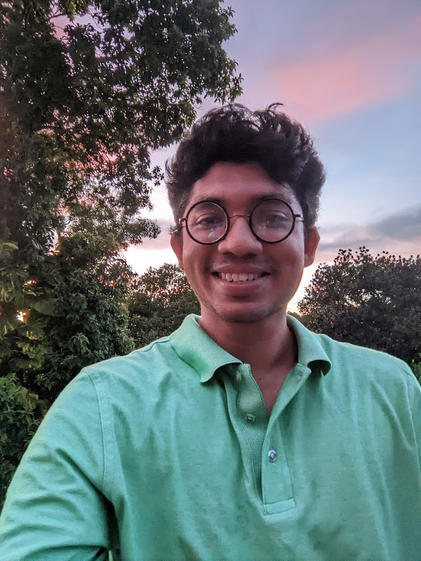
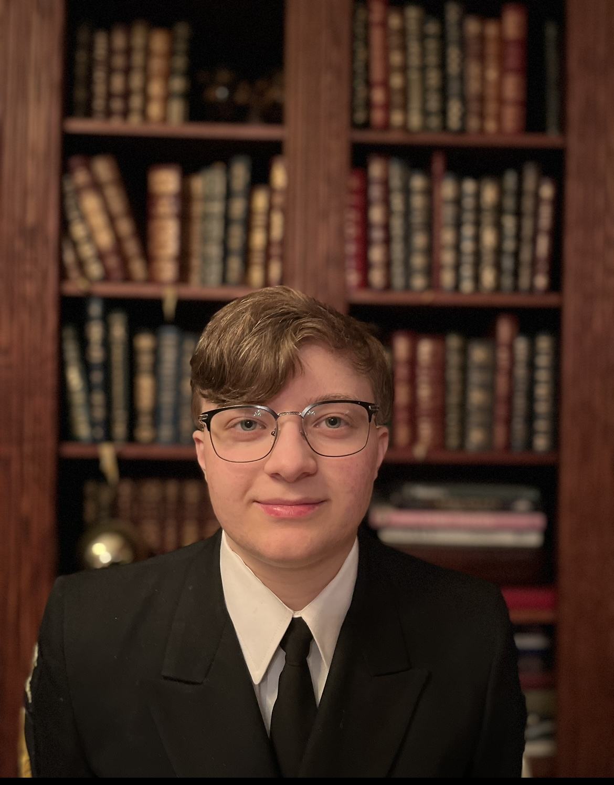
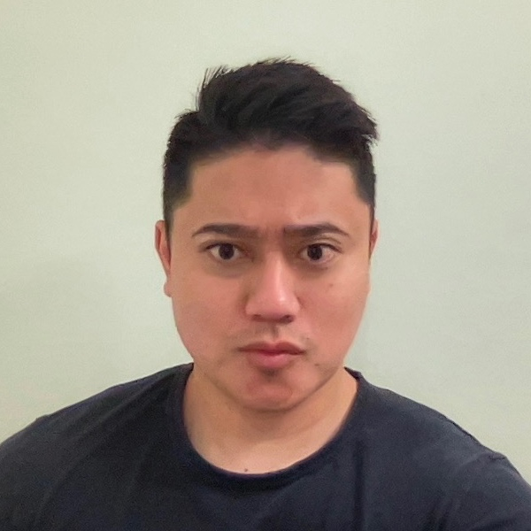
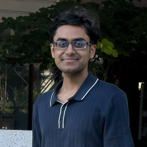

# Group Members

## Faculty

{: style="max-width: 15%; height: auto;"}
**Dr. Rakibul Hasan**  
Director of Persue Lab.  
Associate professor in the School of Computing and Augmented Intelligence at ASU.  
Dr. Rakibul is also affiliated with [Cybersecurity and Trusted Foundations](https://globalsecurity.asu.edu/expertise/cybersecurity-and-trusted-foundations) and the [Human, Artificial Intelligence, and Robot Teaming](https://globalsecurity.asu.edu/expertise/human-artificial-intelligence-and-robot-teaming) initiatives.  
**Email:** rhasan3@asu.edu  
**Education:**  
- Ph.D. in Computer Science from Indiana University Bloomington (2020)  
- Postdoctoral researcher at [CISPA Helmholtz Center for Information Security](https://cispa.de/en)

---

## PhD Students

{: style="max-width: 15%; height: auto;"}
**Syed Zami-Ul-Haque Navid**  
PhD Researcher  
**Email:** snavid2@asu.edu  
**Education:** PhD at Arizona State University
**Research:** I am developing an automated pipeline that interacts with Android applications while monitoring their behavior. Our research provides more granular insight than prior works into how apps access and transmit users' sensitive data. Additionally, we aim to investigate whether apps handle user information differently across various geolocations.

{: style="max-width: 15%; height: auto;"}
**Khalid Alasiri**  
PhD Researcher  
**Email:** kalasir1@asu.edu  
**Education:** PhD at Arizona State University
**Research:** I am working to develop proactive cyber defense mechanisms that will dynamically adapt to the attacker's behaviors and attack strategy.

---

## Master Students

{: style="max-width: 15%; height: auto;"}
**Sri Harsha Gajavalli**  
Graduate Researcher  
**Email:** sgajaval@asu.edu  
**Education:** Master at Arizona State University

---

## Undergraduate Students

{: style="max-width: 15%; height: auto;"}
**Easton Kelso**  
Undergraduate Researcher  
**Email:** eakelso@asu.edu  
**Education:** Undergraduate at Arizona State University

**Research:** I am researching to unveil the privacy and security hurdles within the education technology (edtech) landscape in regards to Higher Education Institutions (HEIs). The first stretch of research has uncovered the challenges that HEIs face during the acquisition process of these edtechs. Our first study, uncovered the EdTech acquisition process in the HEI context including the consideration of security and privacy issues throughout that process, the pain points of HEI personnel in establishing adequate protection mechanisms in service contracts, and their struggle in holding vendors accountable due to a lack of visibility into their system and power-asymmetry, among other reasons. Continued research involves understanding the differing technologies that faculty use at HEIs that are unsanctioned by their institutions to uncover any privacy and security concerns that are involved.

{: style="max-width: 15%; height: auto;"}
**Junichi Koizumi**  
Undergraduate Researcher  
**Email:** jkoizum1@asu.edu  
**Education:** Undergraduate at Arizona State University

{: style="max-width: 15%; height: auto;"}
**Mrinaal Ramachandran**  
Undergraduate Researcher  
**Email:** mrinaalr@icloud.com  
**Education:** Undergraduate at Arizona State University

{: style="max-width: 15%; height: auto;"}
**Saharsh Goenka**  
Undergraduate Researcher  
**Email:** sgoenka1@asu.edu  
**Education:** Undergraduate at Arizona State University

{: style="max-width: 15%; height: auto;"}
**Adit Prabhu**  
Undergraduate Researcher  
**Email:** adprabh2@asu.edu  
**Education:** Undergraduate at Arizona State University

