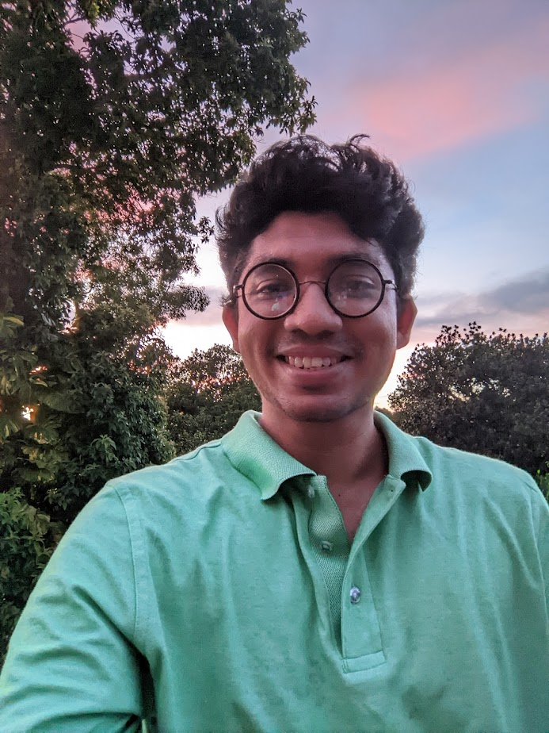
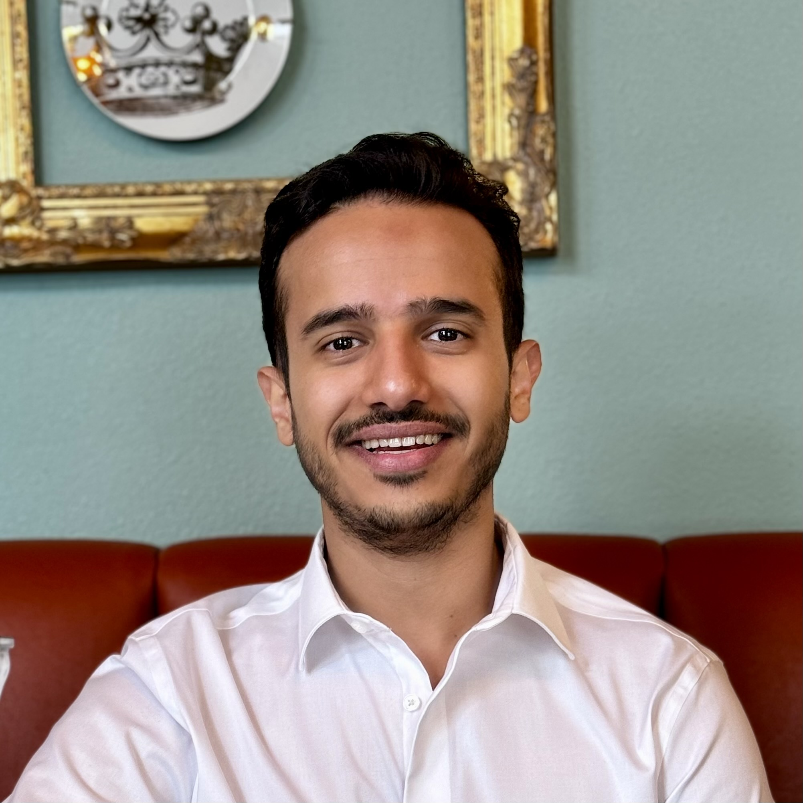
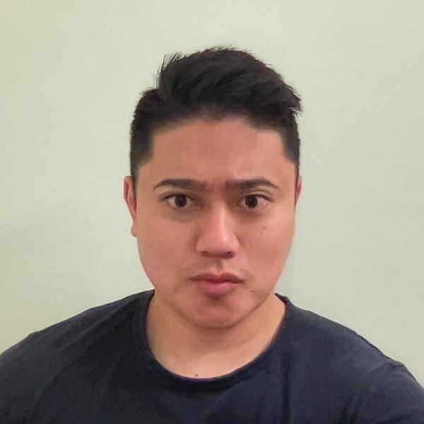
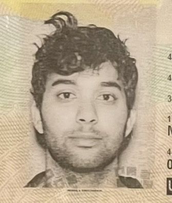
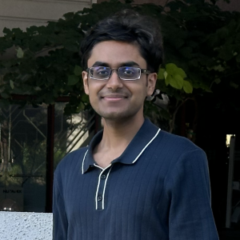
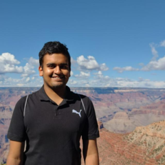

# Group Members

## Faculty

{: style="max-width: 15%; height: auto;"}
**Dr. Rakibul Hasan**  
Director of Persue Lab.  
Assistant professor in the School of Computing and Augmented Intelligence at ASU.  
Other affiliations: [Cybersecurity and Trusted Foundations](https://globalsecurity.asu.edu/expertise/cybersecurity-and-trusted-foundations), [Human, Artificial Intelligence, and Robot Teaming](https://globalsecurity.asu.edu/expertise/human-artificial-intelligence-and-robot-teaming), and [Learning Engineering Institute](https://learningengineering.asu.edu/) at ASU.  
**Email:** rhasan3@asu.edu  
**Education:**  
- Ph.D. in Computer Science from Indiana University Bloomington (2020)  
- Postdoctoral researcher at [CISPA Helmholtz Center for Information Security](https://cispa.de/en)

---

## PhD Students

{: style="max-width: 15%; height: auto;"}
**Syed Zami-Ul-Haque Navid**  
PhD Researcher  
**Email:** snavid2@asu.edu  
**Education:** PhD at Arizona State University

**Research:** I am developing an automated pipeline that interacts with Android applications while monitoring their behavior. Our research provides more granular insight than prior works into how apps access and transmit users' sensitive data. Additionally, we aim to investigate whether apps handle user information differently across various geolocations.

{: style="max-width: 15%; height: auto;"}
**Khalid Alasiri**  
PhD Researcher  
**Email:** kalasir1@asu.edu  
**Education:** PhD at Arizona State University

**Research:** I am working to develop proactive cyber defense mechanisms that will dynamically adapt to the attacker's behaviors and attack strategy.

{: style="max-width: 15%; height: auto;"}
**Wesley Kwan**

PhD Researcher 

**Education:** PhD at Arizona State University

**Research:** Previously, I researched ways to predict hacker behavior for cyber-threat intelligence by designing systems to collect and analyze data from forums and marketplaces on the dark web. At PERSUE Lab, I aim to uncover and understand mechanisms behind the decisions of digital actors through causal machine learning, particularly as it pertains to user privacy and system security.

{: style="max-width: 15%; height: auto;"}
**Fabiha Neaz**  
PhD Researcher  
**Email:** fneaz@asu.edu  
**Education:** PhD at Arizona State University

**Research:** My research explores how narrative visualization and interactive design can make abstract data privacy concepts visible, explorable, and intuitive.

.jpg){: style="max-width: 15%; height: auto;"}
**Easton Kelso**  
PhD Researcher  
**Email:** eakelso@asu.edu  
**Education:** PhD at Arizona State University

**Research:** I am working to unveil the privacy and security hurdles within Higher Education Institutions (HEIs), including in education technologies and data stewardship.
---

## Master Students

{: style="max-width: 15%; height: auto;"}
**Sri Harsha Gajavalli**  
Graduate Researcher  
**Email:** sgajaval@asu.edu  
**Education:** Master at Arizona State University

---

## Undergraduate Students

{: style="max-width: 15%; height: auto;"}
**Junichi Koizumi**  
Undergraduate Researcher  
**Email:** jkoizum1@asu.edu  
**Education:** Undergraduate at Arizona State University

{: style="max-width: 15%; height: auto;"}
**Mrinaal Ramachandran**  
Undergraduate Researcher  
**Email:** mrinaalr@icloud.com  
**Education:** Undergraduate at Arizona State University

{: style="max-width: 15%; height: auto;"}
**Saharsh Goenka**  
Undergraduate Researcher  
**Email:** sgoenka1@asu.edu  
**Education:** Undergraduate at Arizona State University

{: style="max-width: 15%; height: auto;"}
**Adit Prabhu**  
Undergraduate Researcher  
**Email:** adprabh2@asu.edu  
**Education:** Undergraduate at Arizona State University

{: style="max-width: 15%; height: auto;"}
**Asish Panda**  
Undergraduate Researcher  
**Email:** apanda13@asu.edu  
**Education:** Undergraduate at Arizona State University

**Bio and Research interest**: I am a Computer Science Junior at Arizona State University, part of the Barrett Honors College and the Grand Challenges Scholar Program. Being passionate about AI, I focus on human-robot interactions, machine learning, and autonomous vehicles. As a National Master in chess, I have honed my strategic thinking and problem-solving skills. Representing my chess team from middle school to now has strengthened my leadership, teamwork, and decision-making abilities under pressure.

