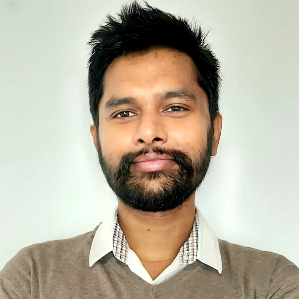

 # Group Members

 ## Staff
 name: Dr. Rakibul Hasan

  info: Director of Persue Lab. Associate professor in the School of Computing and Augmented Intelligence at ASU
  Dr. Rakibul is also affiliated with <a href= "https://globalsecurity.asu.edu/expertise/cybersecurity-and-trusted-foundations/"> Cybersecurity and Trusted Foundations </a> and the <a href = "https://globalsecurity.asu.edu/expertise/human-artificial-intelligence-and-robot-teaming/">Human, Artificial Intelligence, and Robot Teaming </a> initiatives.
  email: rhasan3@asu.edu
  education1: Ph.D. in Computer Science from Indiana University Bloomington in 2020, advised by Prof. Apu Kapadia.
  education2: postdoctoral researcher at <a href= "https://cispa.de/en"> CISPA Helmholtz Center for Information Security</a> 
 

  ## Phd students 
  
  name: Syed Zami-Ul-Haque Navid
  
  info: Phd researcher 
  email: snavid2@asu.edu
  education: PhD at Arizona State University

  name: Khalid Alasiri
  
  info: Phd researcher 
  email: kalasir1@asu.edu
  education: Phd, Arizona State University 

  ## Master Students

  name: Sri Harsha Gajavalli
  
  info: Graduate researcher 
  email: sgajaval@asu.edu 
  education: Master, Arizona State University 

  ## Undergradute Students 

  name: Easton Kelso 
  
  info: undergraduate researcher 
  email: eakelso@asu.edu
  education: Undergraduate, Arizona State University 
  
  name: Junichi Koizumi 
  
  info: undergraduate researcher 
  email: jkoizum1@asu.edu
  education: Undergradute, Arizona State University 

  name: Mrinaal Ramachandran
  
  info: Undergraduate Researcher 
  email: mrinaalr@icloud.com
  education: Undergraduate, Arizona State University 

  name: Saharsh Goenka
  
  info: Undergraduate Researcher 
  email: sgoenka1@asu.edu
  education: Undergraduate, Arizona State University 

  name: Adit Prabhu
  
  photo : Adit_PFP1.jpeg
  info : Undergradute Researcher 
  email : adprabh2@asu.edu
  education : Undergraduate, Arizona State University 
  
 

