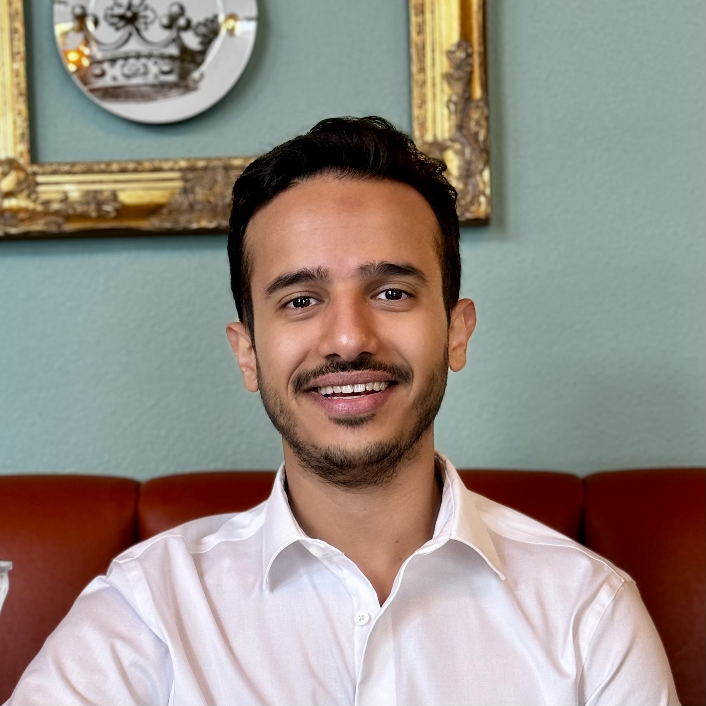

# Group Members

## Staff



    
  
<strong>Dr. Rakibul Hasan</strong> Director of Persue Lab Associate professor in the School of Computing and Augmented Intelligence at ASU. 
  Dr. Rakibul is also affiliated with <a href="https://globalsecurity.asu.edu/expertise/cybersecurity-and-trusted-foundations">Cybersecurity and Trusted Foundations</a> and the <a href="https://globalsecurity.asu.edu/expertise/human-artificial-intelligence-and-robot-teaming">Human, Artificial Intelligence, and Robot Teaming</a> initiatives. 
  <strong>Email:</strong> rhasan3@asu.edu 
  <strong>Education:</strong> Ph.D. in Computer Science from Indiana University Bloomington (2020), postdoctoral researcher at <a href="https://cispa.de/en">CISPA Helmholtz Center for Information Security</a>



## PhD Students



  

    
    
<strong>Syed Zami-Ul-Haque Navid</strong> PhD Researcher <strong>Email:</strong> snavid2@asu.edu <strong>Education:</strong> PhD at Arizona State University

  

  

    
    
<strong>Khalid Alasiri</strong> PhD Researcher <strong>Email:</strong> kalasir1@asu.edu <strong>Education:</strong> PhD at Arizona State University

  



## Master Students



  

    
    
<strong>Sri Harsha Gajavalli</strong> Graduate Researcher <strong>Email:</strong> sgajaval@asu.edu <strong>Education:</strong> Master at Arizona State University

  



## Undergraduate Students



  

    
    
<strong>Easton Kelso</strong> Undergraduate Researcher <strong>Email:</strong> eakelso@asu.edu <strong>Education:</strong> Undergraduate at Arizona State University

  

  

    
    
<strong>Junichi Koizumi</strong> Undergraduate Researcher <strong>Email:</strong> jkoizum1@asu.edu <strong>Education:</strong> Undergraduate at Arizona State University

  

  

    
    
<strong>Mrinaal Ramachandran</strong> Undergraduate Researcher <strong>Email:</strong> mrinaalr@icloud.com <strong>Education:</strong> Undergraduate at Arizona State University

  

  

    
    
<strong>Saharsh Goenka</strong> Undergraduate Researcher <strong>Email:</strong> sgoenka1@asu.edu <strong>Education:</strong> Undergraduate at Arizona State University

  

  

    
    
<strong>Adit Prabhu</strong> Undergraduate Researcher <strong>Email:</strong> adprabh2@asu.edu <strong>Education:</strong> Undergraduate at Arizona State University

  


